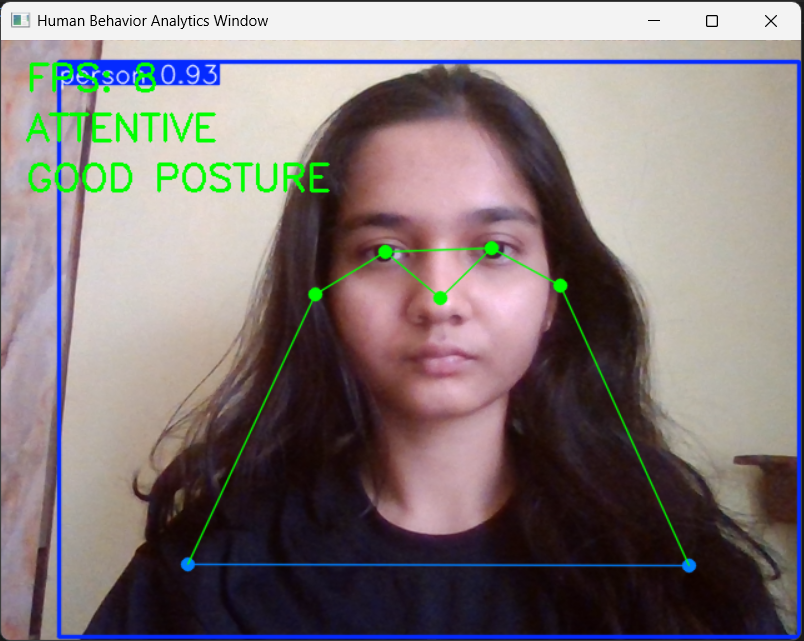
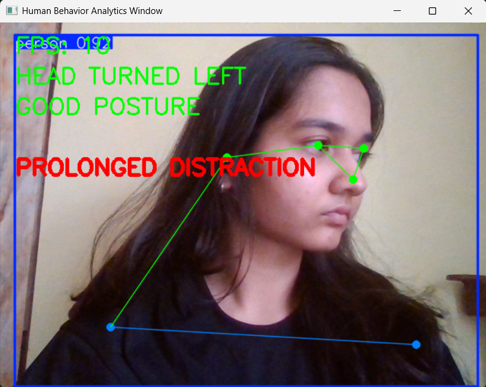

# Real-Time Human Behavior Analytics

A real-time AI-powered video analytics system that monitors human attentiveness and posture using YOLOv8-pose, OpenCV, and temporal behavior analysis.

This project analyzes live webcam video to detect upper-body behavioral patterns such as:

* Attentiveness
* Head orientation changes
* Slouching posture
* Prolonged distraction

The system performs real-time pose estimation, extracts human body keypoints, and applies geometric and temporal reasoning to interpret behavior from live video streams.

---

# Demo Output

## Attentive State

The system detects when the user is facing forward and maintaining attentive posture.



---

## Prolonged Distraction Detection

The system performs temporal behavior analysis and triggers a distraction alert when head orientation remains turned away continuously for a sustained duration.



---

# Overview

This project is a real-time computer vision pipeline that performs upper-body behavioral analysis using pose estimation and geometric reasoning.

Unlike traditional pose detection demos that only visualize skeletons, this system interprets pose information to infer behavioral states in real time.

The project focuses on:

* Real-time inference
* Lightweight CPU-based execution
* Modular AI pipeline design
* Temporal behavior analysis
* Real-world video analytics concepts

---

# Features

* Real-time webcam-based behavior analysis
* YOLOv8-pose based upper-body keypoint detection
* Head orientation monitoring
* Attentiveness estimation
* Posture analysis and slouch detection
* Temporal distraction detection
* Real-time AI overlays
* FPS monitoring
* Lightweight optimized inference pipeline
* Modular and scalable architecture

---

# Tech Stack

* Python
* OpenCV
* YOLOv8-Pose
* Ultralytics
* NumPy

---

# Project Architecture

```bash
real-time-human-behavior-analytics/
│
├── core/
│   ├── fps_monitor.py
│   └── video_stream.py
│
├── detectors/
│   └── pose_detector.py
│
├── demo/
│   ├── attentive_state.png
│   └── distraction_detection.png
│
├── app.py
├── requirements.txt
└── README.md
```

---

# System Pipeline

```text
Webcam Video Input
        ↓
YOLOv8 Pose Estimation
        ↓
Human Keypoint Extraction
        ↓
Geometric Behavior Analysis
        ↓
Temporal Reasoning
        ↓
Real-Time Behavioral Alerts
```

---

# Behavioral Analysis Logic

## 1. Head Orientation Monitoring

The system extracts:

* Nose keypoint
* Left shoulder
* Right shoulder

A shoulder midpoint is computed and compared against the nose position to estimate head orientation.

Behavioral states:

* ATTENTIVE
* HEAD TURNED LEFT
* HEAD TURNED RIGHT

---

## 2. Posture Analysis

The average vertical shoulder position is used to estimate posture quality.

Behavioral states:

* GOOD POSTURE
* SLOUCHING

---

## 3. Temporal Behavior Analysis

The system performs temporal behavior analysis by monitoring sustained head orientation changes across consecutive frames.

If distraction persists continuously for a predefined duration, the system triggers:

```text
PROLONGED DISTRACTION
```

This reduces false behavioral alerts caused by momentary movements.

---

# Performance Optimization

To achieve real-time CPU inference:

* YOLOv8n-pose model was used
* Input image size reduced to 320
* Verbose inference logging disabled
* Lightweight modular pipeline implemented

These optimizations improved:

* FPS
* inference speed
* responsiveness
* CPU performance

Achieved stable 8–10 FPS on CPU (Intel/AMD) without GPU acceleration.

---

# How To Run

## 1. Clone Repository

```bash
git clone https://github.com/shreshtharoyy/real-time-human-behavior-analytics.git
```

---

## 2. Navigate To Project

```bash
cd real-time-human-behavior-analytics
```

---

## 3. Create Virtual Environment

```bash
python -m venv venv
```

---

## 4. Activate Environment

### Windows

```bash
venv\Scripts\activate
```

### Linux / Mac

```bash
source venv/bin/activate
```

---

## 5. Install Dependencies

```bash
pip install -r requirements.txt
```

---

## 6. Run Application

```bash
python app.py
```

---

# Current Capabilities

* Real-time pose estimation
* Upper-body behavioral analysis
* Attention monitoring
* Posture monitoring
* Temporal distraction analysis
* Real-time AI overlays

---

# Applications

* Driver Monitoring Systems
* Workplace Safety Monitoring
* Smart Surveillance Systems
* Human Attention Analysis
* Human-Computer Interaction
* Behavioral Analytics Research

---

# Future Improvements

* Eye gaze estimation
* Multi-person behavior tracking
* Streamlit/FastAPI deployment
* Behavioral scoring system

---

# Key Learnings

This project helped build understanding in:

* Real-time computer vision pipelines
* Pose estimation systems
* Behavioral analytics
* Temporal reasoning in video streams
* Modular AI engineering
* Performance optimization
* Human pose geometry analysis

---

# License

This project is open-source and available for educational and research purposes.
